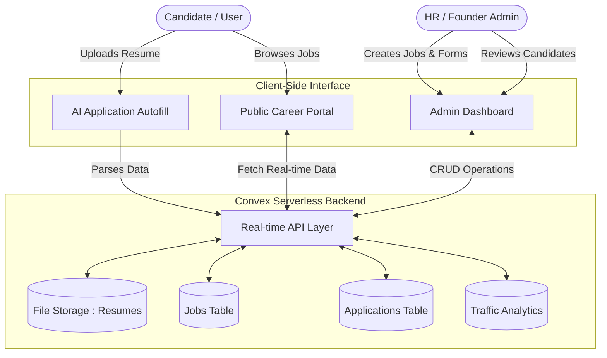

<div align="center">
  <br />
  <a href="https://github.com/shriyashsoni/-OpenHire" target="_blank">
    
  </a>
  <br />
  <br />

  <h1>OpenHire — Open Source HR Platform</h1>
  
  <p>
    An enterprise-grade, highly customizable, open-source Applicant Tracking System (ATS) and Career Portal designed specifically for modern startups.
  </p>

  <p align="center">
    <a href="https://openhire.shriyashsoni.social/"><strong>🌍 Visit the Official Website</strong></a>
  </p>

  <p>
    <a href="https://github.com/shriyashsoni/-OpenHire/stargazers"></a>
    <a href="https://github.com/shriyashsoni/-OpenHire/network/members"></a>
    <a href="https://github.com/shriyashsoni/-OpenHire/issues"></a>
    
    
  </p>
  
  <p><i>If you find this project useful, please consider giving it a ⭐ to show your support!</i></p>
</div>

---

## 🎯 System Overview

**OpenHire** was built to solve a critical problem for founders: spinning up a beautiful, SEO-optimized, fully functional careers page and ATS without spending hundreds of dollars on third-party SaaS tools. With a single CLI command, you can deploy a customized HR portal seamlessly integrated with your brand identity and a real-time Convex backend.

### 🏗️ High-Level System Architecture

The entire platform is built with a serverless, decoupled architecture ensuring extreme speed and infinite scalability.



---

## ✨ Enterprise-Grade Features


*   **1-Click CLI Scaffolding**: Enter your brand Hex code, URLs, and company name, and the CLI will instantly re-theme the entire platform to match your startup.
*   **AI-Powered Parsing**: Candidates can upload PDF resumes, and the client-side parser will automatically map their experience to your custom questions.
*   **Dynamic Custom Question Logic**: Create dynamic application questions through the Admin portal. Support for long answers, multiple choice, conditional logic, checkboxes, and file uploads.
*   **Automated SEO & Social Graph**: Dynamic metadata tagging ensures that when a job is shared on LinkedIn, Discord, or X (Twitter), the exact job title, location, and company branding render perfectly.
*   **Out-of-the-Box Legal**: Automatically generates standard `Privacy Policy` and `Terms & Conditions` tailored to your company details.
*   **Real-time Admin Dashboard**: Track visit analytics, review applicants in a Kanban-style workflow, and download applicant resumes with zero backend config required.

---

## 🚀 Quick Start Guide

Transform your recruitment pipeline in under 3 minutes.

### 1. Scaffold Your Platform
Open your terminal and run the interactive SDK:

```bash
npx create-open-hire
```
*The CLI will ask for your **Company Name**, **Website URL**, and **Brand Color**. It will inject these across the entire architecture.*

### 2. Install Dependencies
```bash
cd <your-project-name>
npm install
```

### 3. Initialize the Convex Backend
OpenHire leverages Convex for real-time state and database management.

```bash
npx convex dev
```
*(Press **Enter** to authenticate and authorize the creation of your database schema. Leave this terminal running to sync real-time changes).*

### 4. Seed the Admin User
In a **new terminal tab**, generate your default administrator credentials to access the secure backend:

```bash
npx convex run seed:createDefaultAdmin
```
*(You can modify default passwords by editing `convex/seed.ts` before running this command).*

### 5. Launch the Portal
```bash
npm run dev
```
Navigate to `http://localhost:5173`. 
To access the backend management portal, navigate to `http://localhost:5173/admin.html` and log in with your generated admin credentials.

---

## 🤖 AI Auto-Branding Pipeline (New!)

We've introduced a powerful **Auto-Branding Python Pipeline** (`auto_brand_pipeline.py`) that acts as an intelligent wrapper around the CLI. It can scan an existing company's website repository, automatically extract their branding (Company Name, Tagline, URL, Contact Email, Primary Color, and Logo), and feed it directly into the CLI to generate a matching career page instantly.

### How to use the Python Pipeline:
```bash
python auto_brand_pipeline.py <path-to-target-repo> --output-dir <your-new-career-page>
```

### 🧠 Prompt for AI Agents
If you are using an AI Agent (like Claude, ChatGPT, or Cursor) to set up this repository for you, you can give it the following prompt to completely automate the white-labeling process:

\`\`\`markdown
We are using the \`create-open-hire\` CLI to generate a custom, open-source HR and Careers platform. 
Please act as an autonomous developer and do the following:

1. Run the Python Auto-Brand pipeline or the CLI tool: \`npx create-open-hire my-hr-platform\`
2. The CLI will ask for configuration details. Please provide the following details automatically:
   - Company Name: [Insert Target Company Name]
   - Company Tagline/Mission: [Insert Target Company Tagline]
   - Website URL: [Insert Target Website URL]
   - Primary Brand Color: [Insert Hex Code]
   - Support/Contact Email: [Insert Support Email]
3. After the CLI finishes generating the codebase, navigate to the \`public/\` and root folders and replace \`logo.jpg\`, \`logo.png\`, and \`logo.svg\` with the actual logo files of [Target Company].
4. Run \`npm install\` and \`npx convex dev\` to initialize the clean, 0-job database.
5. Provide me with the link to the Admin Panel so I can start adding our own jobs manually.

Ensure no data, jobs, or branding from the original creator remains. The final product must be 100% white-labeled for [Target Company].
\`\`\`

---

## 👨‍💻 Created & Maintained By

<div align="center">
  
  <br /><br />
  <b>Shriyash Soni</b>
  <p>AI Developer, Architect, & Open-Source Contributor</p>
  <a href="https://github.com/shriyashsoni"></a>
  <a href="https://linkedin.com/in/shriyashsoni"></a>
</div>

> *"I built OpenHire because I believe founders shouldn't have to sacrifice branding or spend hours configuring clunky third-party recruitment software just to hire their founding team. OpenHire is my contribution to the startup ecosystem—an ATS built by a builder, for builders."* — **Shriyash Soni**

---

## 🤝 Contributing & Support

Contributions, issues, and feature requests are highly encouraged! Feel free to check the [issues page](https://github.com/shriyashsoni/-OpenHire/issues). 

### Don't forget to leave a ⭐ if you found this project helpful! It helps the platform reach more founders.
